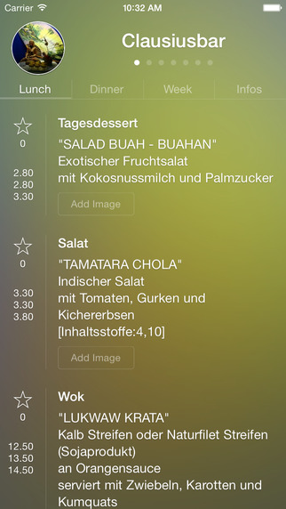

# ETHZ Mensa iOS App

An iOS application for viewing daily meals and menus from ETH Zurich and University of Zurich cafeterias (mensas). The app displays current meal offerings, prices, images, and provides features for meal rating and sharing.


*Screenshot showing the main interface with daily meal listings*

## Features

- 📱 **Daily Meal Display**: View current meals from ETH Zurich and Uni Zurich cafeterias
- 💰 **Price Information**: See meal prices and descriptions
- 📸 **Photo Sharing**: Upload and view meal photos from other users
- ⭐ **Meal Rating**: Rate and like meals
- 🗺️ **Location Maps**: Find cafeteria locations with integrated maps
- 📹 **Live Webcams**: View live webcam feeds from select locations
- 🔄 **Weekly Menus**: Browse weekly meal schedules

## App Store

The compiled app is available on the [App Store](https://itunes.apple.com/ch/app/ethz-mensa-uni-zurich-mensa/id438058092?mt=8).

## Technical Requirements

- **iOS Version**: iOS 7.0 or later
- **Architecture**: armv7 (32-bit) support required
- **Xcode**: Xcode 5.0 or later recommended
- **Device Support**: iPhone and iPad (universal app)

## Dependencies

The project includes the following third-party libraries:

- **AFNetworking 2.x**: HTTP networking library
- **Google Analytics**: User analytics (libGoogleAnalyticsServices.a)
- **UIKit Extensions**: Custom UI components and effects

## Setup Instructions

### Prerequisites

1. Xcode 5.0 or later
2. iOS 7.0+ SDK
3. Apple Developer account (for device deployment)

### Building the Project

1. Clone this repository:
   ```bash
   git clone https://github.com/maerki/ethz-mensa-ios.git
   cd ethz-mensa-ios
   ```

2. Open `Mensa.xcodeproj` in Xcode

3. **Configure Backend API** (Required):
   - Find all instances of `BACKEND_API_PATH` in the codebase
   - Replace with your backend API URL in the following files:
     - `Mensa/Backend/ETHBackend.h`
     - `Mensa/Backend/ETHBackend.m`
     - `Mensa/UI/MensaContent/ETHImageViewController.m`
     - `Mensa/UI/MensaContent/ETHMensaMenuCell.m`

4. Build and run the project in Xcode

### Backend API Configuration

**Important**: This app requires a backend API to function. The original backend is not open-sourced. To use this app, you need to:

1. **Create your own backend API** that provides:
   - Meal data in JSON format
   - Image upload/download capabilities  
   - User authentication (optional)
   - Meal rating/voting system

2. **Update API endpoints** by replacing all `BACKEND_API_PATH` placeholders with your actual API URL

3. **API Response Format**: The app expects specific JSON response formats for meals, images, and other data. Examine the existing code to understand the expected data structure.

## Project Structure

```
Mensa/
├── Backend/                    # Networking and API communication
│   ├── ETHBackend.h/.m        # Main backend interface
│   ├── AFNetworking/          # HTTP networking library
│   └── GAI/                   # Google Analytics integration
├── UI/                        # User Interface components
│   ├── MensaContent/          # Main content views and cells
│   ├── Background/            # Background visual effects
│   └── MiniGame/              # Additional game features
├── Helpers/                   # Utility classes and extensions
└── Resources/                 # Images, assets, and configuration files
```

## License

This project is licensed under the Apache License 2.0. See the [LICENSE](LICENSE) file for details.

## Development Notes

- This was a personal project built during my studies at ETH Zurich
- The UI was redesigned multiple times as a learning exercise
- Code quality was not the primary focus - this was built for functionality and learning
- The project is no longer actively maintained

## Contributing

Since this project is no longer actively maintained, contributions are not expected. However, you're free to fork the project and adapt it for your own use.

## Contact

[@nmaerki](https://twitter.com/nmaerki)
